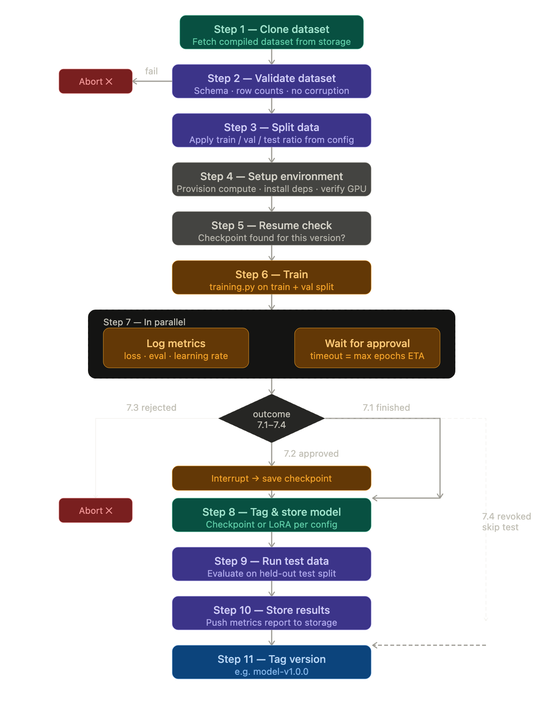

# Training Template

A standardised template for fine-tuning ML models — from dataset ingestion through training, evaluation, and versioned model storage. Supports Colab, Vast.ai, AWS spot, and GCP spot as compute backends, in that priority order.

---

## Repository structure

```
.
├── scripts/
│   └── training.py           # Main training script — called by the pipeline
│
└── configuration.yaml        # Pipeline control (see below)
```

---

## Configuration

```yaml
version: "1.0.0"

dataset:
  repo_id: "my-org/my-compiled-dataset"   # Storage location of the compiled dataset
  revision: "main"

split:
  train: 0.8
  val:   0.1
  test:  0.1

training:
  max_epochs: 10               # Hard stop if user approval never arrives
  max_steps: null              # Alternative to max_epochs; set one or the other
  save_mode: checkpoint        # checkpoint | lora
  run_test_after: true         # Run step 9 on completion

compute:
  priority:
    - colab
    - vastai
    - aws
    - gcp
  vastai:
    gpu_name: RTX_3090
    max_dph: 0.40
    image: "pytorch/pytorch:2.2.0-cuda12.1-cudnn8-devel"
  aws:
    instance_type: g4dn.xlarge
    spot: true
  gcp:
    machine_type: n1-standard-8
    accelerator: nvidia-tesla-t4
    spot: true

output:
  name: "my-model"
  destination: github          # github | gdrive
  branch: models
  folder_id: ""                # Google Drive folder ID (if destination: gdrive)

tag:
  enabled: true
  prefix: "model"              # Tag format: <prefix>-v<version>  e.g. model-v1.0.0
```

---

## Pipeline



### Steps

**Step 1 — Clone dataset**
Pull the compiled dataset from the configured storage location.

**Step 2 — Validate dataset**
Integrity check — schema, row counts, no file corruption. Aborts on failure.

**Step 3 — Split data**
Partition into train / val / test sets using the ratios in `configuration.yaml`.

**Step 4 — Setup environment**
Provision the compute backend (in priority order: Colab → Vast.ai → AWS → GCP). Install dependencies and verify GPU availability.

**Step 5 — Resume check**
Look for an existing checkpoint matching the current `version`. If found, training resumes from it rather than starting over.

**Step 6 — Train**
Run `scripts/training.py` on the train + val split. Loops until `max_epochs` or `max_steps` is reached.

**Step 7 — In parallel: log metrics + wait for approval**
While training runs, metrics (loss, eval, learning rate) are streamed to the CI log. Simultaneously, the pipeline waits for a user approval decision:

| Outcome | Behaviour |
|---|---|
| 7.1 Training finishes naturally | Auto-success, proceed to Step 8 |
| 7.2 User approves | Interrupt training → save checkpoint → proceed to Step 8 |
| 7.3 User rejects | Abort. Nothing is saved or tagged. |
| 7.4 Spot revocation (AWS / GCP) | Emergency checkpoint save → skip Steps 9–10 → proceed to Step 11 |

**Step 8 — Tag & store model**
Save the model artefact (full checkpoint or LoRA adapter per `save_mode`) to the configured destination.

**Step 9 — Run test data**
Evaluate the stored model on the held-out test split. Skipped if `run_test_after: false` or if triggered by spot revocation.

**Step 10 — Store results**
Push the evaluation metrics report alongside the model artefact.

**Step 11 — Tag version**
Create a Git tag in the format `<prefix>-v<version>` (e.g. `model-v1.0.0`) on the storage branch. Marks the artefact as permanently reproducible.

---

## CI behaviour summary

| Event | Steps run |
|---|---|
| Push / pull request | Steps 1–2 only (clone + validate) |
| Merge to main | Full pipeline (Steps 1–11) |
| Spot revocation | Steps 1–8, 11 (test skipped, model still saved) |

---

## Implementing this template

1. **Point at your dataset** — set `dataset.repo_id` and `revision` to the output of your dataset template pipeline.
2. **Configure your split** — adjust `split` ratios; they must sum to 1.0.
3. **Write `scripts/training.py`** — the script receives split paths and config values as arguments. It should checkpoint regularly and handle `SIGTERM` for spot revocation.
4. **Choose your compute** — fill in the relevant block(s) under `compute`. The pipeline tries each backend in priority order.
5. **Set `save_mode`** — use `lora` to store only the adapter weights, `checkpoint` for the full model.